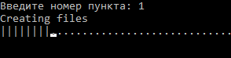

# Демострация работы

Сначала вводятся данные для подключения к бд, с готовой таблицей

Появляется меню, в котором можно выбирать нужные действия сколько угодно

Пункт 1 генерирует 100 файлов на 100 000 строк заданной структуры  и помещает их в папке Files.  
Для ускорения файлы создаются разными потоками.  
Полоса прогресс показывает, сколько осталось. 

Пункт 2 объединяет файлы в папке Files, удаляя заданные через пробел строки.  
объединение происходит быстро, т.к. просто копирует один файл в конец другого,  
но функция удаления медленная, т.к. проходит по каждой строке финального файла.  
Нахождение сочетаний букв в строках разбито на потоке, но с большим файлом все равно работа долгая 

Пункт 3 файлы из папки Files помещает в бд с помощью MySqlBulkLoader,  который показывает количество импортированных строк
только после того, как полностью импортирует

Пункт 4 получает из бд сумма целых чисел и медиану дробных  
операции медленные при больших данных. Если данных слишком много, может появиться ошибка слишком долгого ожидания

